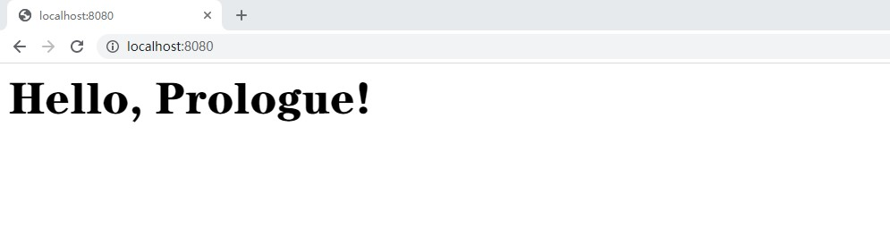

# Quick Start

## Hello World

Now Let's begin a quick tour of `Prologue`.

```nim
# app.nim
import prologue

proc hello*(ctx: Context) {.async.} =
  resp "<h1>Hello, Prologue!</h1>"

var app = newApp()
app.addRoute("/", hello)
app.run()
```

This is a very basic "Hello Prologue" example. Run this script, then visit [http://localhost:8080](http://localhost:8080) and you will
see "Hello, Prologue!" in your browser! Here is how it works.

First we `import prologue` to include all things we need in this example(for examples `resp` macros).

Then let's look at `hello` function. It generates html or plain text or json or something else sent to our HTTP server. The parameter `ctx` is of `Context` type. `Context` carries all things which we can use in our handler in each request. It contains `request` information from HTTP server, `response` information which we transfer to HTTP server Correspondingly and other useful attributes. In the body of function, we can find `resp` macros. `resp` is handy for generating response we need. It is equal to `ctx.response = initResponse("<h1>Hello, Prologue!</h1>")`.

Next let's configure our application. For this basic
example, we use default settings. You can specify parameters of `newSettings` too. For example change `port` attribute or set `debug` flag.

Next add route to our application. `"/"` is the URL we can visit in the web browser. `Hello` is the handler which processes the request from the web browser and sends `"<h1>Hello, Prologue!</h1>"` to the web browser.

Finally use `nim c -r app.nim` to run our application. Visit `localhost:8080`, `Hello, Prologue!` is displayed in your browser.



## Command Line Tool

`logue` can be used to initialize your
program.

Make sure `~/.nimble/bin` is in your environment variables.

Type command `logue init helloworld` to initialize a new project. This will create a program
structure like this:

```
- helloworld
  - .env
  - app.nim
  - urls.nim
  - views.nim
```

You must switch to `/.../helloworld` directory to run `app.nim`. For example, you can type `logue run` and open the browser to visit the URL.

## Debug Mode

There are many ways to enable debug mode. If using default settings, debug mode is enabled too. You can also enable them on your own.

```nim
let settings = newSettings(debug = true)
```

If you use JSON config file:

```json
{
  "prologue": {
    "address": "",
    "port": 8080,
    "debug": true,
    "reusePort": true,
    "appName": "",
    "secretKey": "Set by yourself",
  }
}
```

Set `debug = false` to disable debug mode.

Once debug mode is enabled, the program will display useful logging messages. It is helpful for debugging. But it will slow down the program. If you want to benchmark or release your program, please set `debug = false`.

## URL Building

`Prologue` provides a special function `urlFor` to get the URL from the name of handler. Before using `urlFor`, you should register the name of handler first.

```nim
proc hello(ctx: Context) {.async.} =
  resp ctx.urlFor("index")

proc index(ctx: Context) {.async.} =
  resp "Hello world"


var app = newApp()
app.get("/hello", hello)
app.get("/index", index, name = "index")
```

If you visit `localhost:8080/hello`, the browser will display `/index` on the screen. `urlFor` only supports two forms of Route: 1. `/route/hello` 2. `/route/{parameter}/other`. So you can also pass parameters to `urlFor`. For example `urlFor("route", {"parameter": "think"})` will build `/route/think/other`. It also supports passing query parameters.

## Static Files

You may want to serve your HTML, CSS files. Static files middleware can be used for this purpose. You should put your static files under `/public` directory.

```nim
import prologue
import prologue/middlewares/staticfile

app.use(staticFileMiddleware("/public"))
```

## Redirect

You can easily redirect to other URL using `redirect` function. The default HTTP code for `redirct` function is Http301. You could use Http302 to move temporarily.

The program below redirects to `localhost:8080/home`.

```nim
proc redirectHome*(ctx: Context) {.async.} =
  resp redirect("/home")
```

## Cookies

`Prologue` provides `setCookie`, `deleteCookie` and `getCookie` to help you with cookies.

The handler below will display the name in the cookies from the client if existing. Otherwise `AnyOne` will be displayed.

```nim
proc hello(ctx: Context) {.async.} =
  resp ctx.getCookie("name", "Anyone")
```

`setCookie` sets the (key, value) pair in the HTTP headers. You could also set the `expires` or `maxAge` of the cookies. These attributes decide when the survival time of the cookies. `deleteCookie` will make the specific key expired at once.
