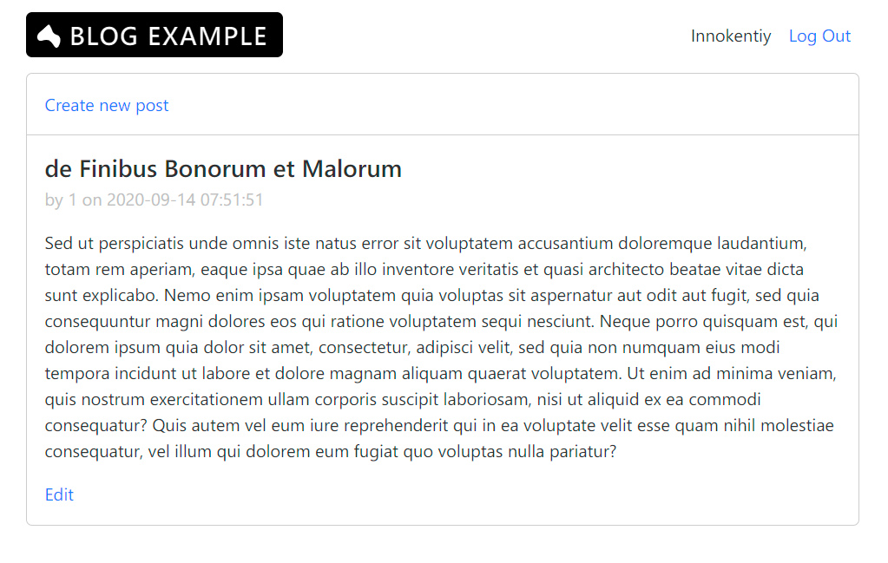

# Prologue Blog Example
## Purpose of this example
The purpose of this 'Blog' example is to cover following basic actions:
- User registration.
- User authentication.
- List multiple records.
- Edit or delete particular record
- Create new record.
 
## Project structure
The structure is straightforward:
```
static
templates
.env
app.nim
blog.db
consts.nim
initdb.nim
schema.sql
urls.nim
views.nim
```

## Screenshot



###  Static folder
Every public assets are stored in this folder.

### Templates folder
This folder is for storing templates written with Karax DSL (domain specific language) which is kind of similar to the popular Pug template engine approach. 
Each template file consists of two procs inside:
- proc ended with `Page` name - it acts as a final template (e.g. `indexPage` or `loginPage` and etc). It's a common top level structure of our template and generally it's the same across all pages.
- proc ended with `Section` name - it is where our actual template layout and logic is written.
 
There are also commonly used blocks (or `chunks`/`partials` - whatever you call them) that are stored in `share` subfolder and we call them inside our templates to reduce duplication in our code.
 
### .env file
Env file holds values necessary to run an application.
 
### app.nim file
Our starting point is where we create the Prologue app.
 
### blog.db
A SQLite database file that will be created automatically when the application runs.
 
### consts.nim
A small file to store constants like database and schema files (yes we could use an .env file for that so existence of this file is questionable).
 
### initdb.nim and schema.sql
A small proc for automatically creating a sqlite db file using schema.sql file if `blog.db` file is absent.
 
### urls.nim
This file is for grouping URL endpoints and linking them to their corresponding procs from `views.nim`.
 
### views.nim
This file contains business logic that is called from 'attached' urls. It's like a 'controller' or a 'route'

## Compile and run project
Simply call `nim compile --run app.nim` and access 127.0.0.1:8080 URL in your browser.

## Miscellaneous
This example uses Marx classless framework with custom modifications made by @keshon